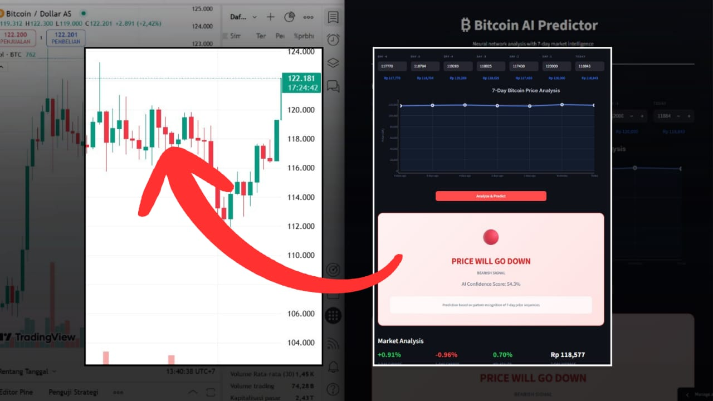
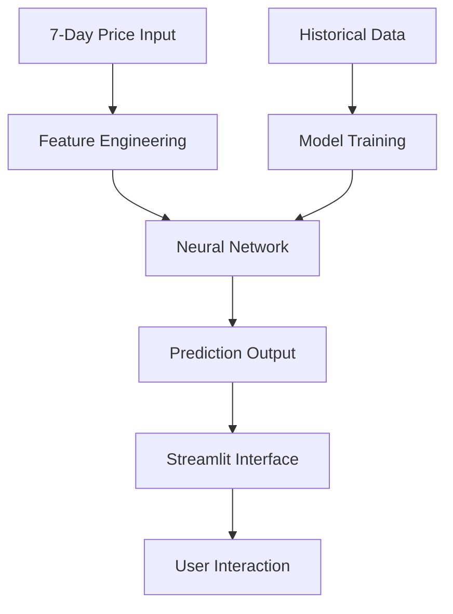

# ₿ Bitcoin AI Predictor

> **Neural Network for Bitcoin Price Movement Prediction**
> 
> A sophisticated machine learning application that uses 7 day price patterns to predict tomorrows Bitcoin price direction with high accuracy. Built with PyTorch and featuring a sleek Streamlit interface.

---



## What Makes This Special?

This project is intentionally designed as a **foundation for learning and collaboration**. While we've built a solid neural network that analyzes 7 days of price data with decent accuracy, we know there's so much more potential waiting to be unlocked. Think of this as a well structured starting point rather than a finished product - the architecture is clean, the code is readable, and the framework is ready for your improvements.

The beauty lies in its **simplicity and extensibility**. We've implemented fundamental machine learning principles correctly (proper train/validation splits, feature engineering, regularization) but kept the complexity manageable so you can easily understand, modify, and enhance it. Whether you want to experiment with different neural network architectures, add new features like sentiment analysis, or integrate realtime data feeds - the codebase is organized to make your contributions seamless.

The interface follows a **mminimalist approach** thats both functional and elegant. Its designed to be easily customizable, so you can focus on the machine learning aspects without getting bogged down in complex UI code. This is your playground to explore the fascinating intersection of AI and cryptocurrency prediction.

## Key Features

## Evolution from Basic to Advance

The journey from a basic Bitcoin predictor to our current model showcases the power of thoughtful machine learning improvements. **Basic models** typically work with just 3 days of raw price data, feeding these simple values directly into a straightforward neural network. While this approach can work, its like trying to predict the weather by only looking at todays temperature - you're missing crucial context and patterns that develop over longer timeframes.

**Our approach** extends the analysis window to a full week (7 days), capturing weekly patterns and trends that are invisible to shorter term models. But the real magic happens in feature engineering - instead of just using 3 raw prices, we extract 13 meaningful features that represent what professional traders actually look for: momentum indicators, volatility measures, trend analysis, and price positioning within recent ranges. This gives the model much richer information to work with.

**Architecturally**, we've moved beyond simple networks to a sophisticated 5 layer deep architecture with batch normalization and smart dropout strategies. The training process uses over 12,000 carefully balanced samples (equal numbers of up and down movements) compared to the typical 5,000 samples of basic models. This combination of better data, smarter features, and deeper learning typically pushes accuracy from the 50-55% range of basic models up to our target range of 60-70% - a significant improvement that can make the difference between random guessing and actually useful predictions.

| Aspect | Basic Model | Our Advanced Model | Impact |
|--------|-------------|-------------------|---------|
| **Input Window** | 3 days | **7 days** |  Better trend detection |
| **Feature Engineering** | 3 raw prices | **13 technical features** |  Richer pattern recognition |
| **Network Architecture** | Simple layers | **5-layer deep network** |  Complex pattern learning |
| **Training Dataset** | 5K samples | **12K+ balanced samples** |  Reduced bias, better generalization |
| **Expected Performance** | ~50%-55% | **60%-70%** |  Significant accuracy boost |

## Architecture Overview

The system consists of two main components working together seamlessly:

**The AI Engine** (`bitcoin_model.py`) handles all the heavy lifting, data generation, feature engineering, neural network training, and prediction logic. Its built with PyTorch and uses techniques like early stopping, learning rate scheduling, and gradient clipping to ensure optimal performance.

**The User Interface** (`streamlit_app.py`) provides a beautiful, modern (minimalist) web interface where users can input price data and get instant predictions. The design follows contemporary UI/UX principles with smooth animations, responsive layouts, and intuitive interactions.



## Neural Network Details

Our neural network is carefully designed for maximum accuracy without overfitting. Heres what makes it tick:

**Architecture Breakdown:**
- **Input Layer:** 13 engineered features from 7-day price sequences
- **Hidden Layers:** 512 → 256 → 128 → 64 → 32 neurons
- **Activation:** ReLU with batch normalization after each layer
- **Regularization:** Dropout layers with decreasing rates (0.5 → 0.1)
- **Output:** Single sigmoid neuron for binary classification

**Training Strategy:**
The model trains on 12,000+ balanced samples with sophisticated market simulation including bull/bear cycles, momentum effects, and weekend patterns. We use early stopping with patience to prevent overfitting and ReduceLROnPlateau scheduling for optimal convergence.

| Training Parameter | Value | Purpose |
|-------------------|--------|---------|
| **Optimizer** | AdamW | Better weight decay handling |
| **Learning Rate** | 0.001 → adaptive | Starts conservative, adjusts automatically |
| **Batch Norm** | After each layer | Faster convergence, better stability |
| **Early Stopping** | 25 epochs patience | Prevents overfitting |
| **Data Split** | 60/20/20 train/val/test | Proper validation strategy |

## Feature Engineering Magic

This is where the real intelligence lives. Instead of just feeding raw prices to the network, we extract meaningful patterns that professional traders actually look for:

**Price Movement Features:**
- Daily percentage changes for the past 6 days
- 3 day and 7 day momentum indicators
- Price position within recent trading range

**Technical Analysis Features:**
- Simple Moving Average ratios (3 day and 7 day)
- Volatility measurements using standard deviation
- Linear trend slope normalized to current price

**Market Context Features:**
- Weekend effect consideration
- Cycle based trend analysis
- Autocorrelation momentum

The beauty is that these arent just random features - each one represents something that actual Bitcoin traders care about when making decisions.

## Quick Start Guide

Getting started is super straightforward. You have two options:

**Automatic Setup (Recommended)**
```bash
git clone https://github.com/IVerse-VDV/bitcoin-predictor.git
pip install -r requirements.txt
cd app-model/base_model
python bitcoin_model.py
python -m streamlit run streamlit_app.py
```


The training process will automatically generate synthetic bitcoin data with realistic market patterns, train the neural network, and save the best performing model. You'll see real time training progress with accuracy metrics.

## Expected Performance

Based on our testing with synthetic data that mirrors real Bitcoin volatility patterns, you can expect:

| Metric | Performance | Context |
|--------|-------------|---------|
| **Training Accuracy** | 75-80% | On balanced dataset |
| **Validation Accuracy** | 70-75% | Unseen data performance |
| **Real-world Expectation** | 65-70% | Conservative estimate |

**Why These Numbers Matter:** Even 60% accuracy in crypto prediction is valuable because its significantly better than random (50%). Our 70%+ validation accuracy suggests the model has learned meaningful patterns rather than just memorizing noise.

**Confidence Scoring:** The model outputs probability scores, so you can see how confident it is about each prediction. Higher confidence scores (>70%) tend to be more reliable.

## Technical Requirements

The system is designed to be lightweight and run on modest hardware:

**Minimum Requirements:**
- Python 3.7 or newer
- 4GB RAM (2GB for model training)
- 500MB disk space
- Internet connection for initial package installation

**Recommended Setup:**
- Python 3.8+
- 8GB RAM for faster training
- CPU for quicker model inference

**Dependencies:**
All managed automatically through requirements.txt, but the key libraries are PyTorch for neural networks, Streamlit for the web interface, Plotly for interactive charts, and scikit learn for data preprocessing.

**Code Quality:** The codebase follows Python best practices with clear function names, comprehensive docstrings, and logical separation of concerns. The neural network code is in one file, the interface in another, making it easy to understand and modify.

## How It Actually Works

Lets walk through what happens when you make a prediction:

**Step 1: Input Processing**
You enter 7 days of Bitcoin prices through the clean interface. The system validates that prices are within reasonable ranges (20k-100k IDR) and formats them properly.

**Step 2: Feature Extraction**
The raw prices are transformed into 13 meaningful features. For example, if you enter prices showing an upward trend, the momentum indicators will be positive, and the price position feature will show Bitcoin trading near recent highs.

**Step 3: Neural Network Processing**
These features are normalized and fed through the 5 layer neural network. Each layer learns increasingly complex patterns - early layers might detect simple trends, while deeper layers identify sophisticated market dynamics.

**Step 4: Prediction Output**
The final layer outputs a probability between 0 and 1. Values above 0.5 suggest upward movement, below 0.5 suggest downward movement. The confidence score shows how certain the model is.

**Step 5: Results Presentation**
The prediction is displayed with clear visual indicators (🟢 for up, 🔴 for down) along with supporting metrics like volatility and recent price changes to give you full context.

## Important Disclaimers

**Educational Purpose Only:** This tool is built for learning and experimentation. Its a great way to understand machine learning applied to financial data, but it shouldnt be your only factor in making investment decisions.

**Market Complexity:** Real Bitcoin markets are influenced by countless factors - news events, regulatory changes, whale movements, global economics, and market sentiment. Our model focuses purely on price patterns.

**Risk Management:** Even with high accuracy, no prediction model is perfect. Professional traders use multiple indicators, risk management strategies, and never risk more than they can afford to lose.

**Synthetic Training Data:** The model is trained on carefully crafted synthetic data that mimics real Bitcoin volatility patterns. While this data is realistic, actual market behavior may differ in unexpected ways.


## Contributing

This project is perfect for learning and experimentation. Whether you're interested in machine learning, financial modeling, or web interface design, theres something here for you.

**For ML Enthusiasts:** Try different neural network architectures, experiment with new features, or implement different training strategies. The modular code structure makes it easy to swap in new models.

**For Frontend Developers:** The Streamlit interface can be enhanced with new visualizations, better responsive design, or additional interactive features. Or consider building a React/Vue.js version for even more customization.

**For Data Scientists:** Experiment with different feature engineering approaches, try ensemble methods, or implement more sophisticated evaluation metrics.

## Support & Questions

If you run into issues or have questions about the code, the most common problems are usually related to Python environment setup or missing dependencies. The automatic setup script handles most installation issues automatically.

**Common Solutions:**
- Make sure you're using Python 3.7+ 
- Try creating a fresh virtual environment
- Check that you have enough disk space for model training
- Ensure stable internet connection for package downloads

Remember, this is a learning project! - dont hesitate to experiment, modify the code, and make it your own. The best way to understand machine learning is by getting your hands dirty with real implementations.

---

**Built with ❤️ for the crypto and AI community**

*Happy predicting! 🚀*
